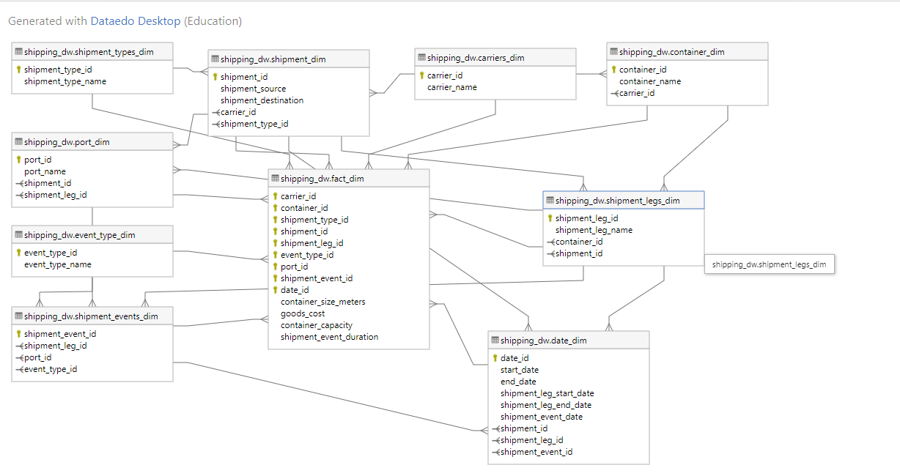

# ShippingDataWarehouse
This project was made for my 'Structured Database Management' class. In this model, I first created a source (OLTP) system and then I created an OLAP datawarehosue which can be used for reporting. 

Following is the ERD Diagram which I made for my project using 'Dataedo':

